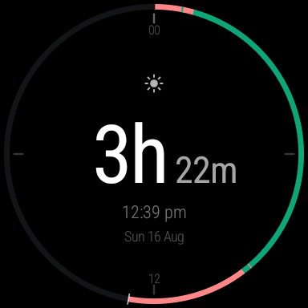
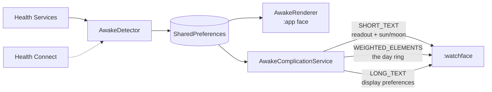

<div align="center">

# Vigil

**A Wear OS watch face that counts time awake, not clock time.**

[](https://kotlinlang.org)
[](https://wearos.google.com)
[](https://github.com/jagenaujagenau/vigil/stargazers)



*A real morning on a Pixel Watch 2: awake past midnight, asleep until 09:17,
three and a bit hours since.*

</div>

## What is this?

A watch face that answers "how long have I been up?" instead of "what time is
it?". The big figure is the stretch you are in — time since you woke, or time
asleep once sleep is detected — and the band around the rim is today, showing
where the night and the day so far actually fell.

It detects sleep and waking on its own through Health Services. There is no way
to enter a wake time by hand: the times shown are observed, never typed.

## Quick Start

```bash
git clone https://github.com/jagenaujagenau/vigil.git
cd vigil
./gradlew :app:assembleRelease

adb install -r app/build/outputs/apk/release/app-release.apk
```

Then on the watch: long-press the current face → **Add new** → **Vigil**, and tap
it again to make it current. Grant the activity permission when asked.

Build **release**, not debug, even for sideloading. Debug builds are unshrunk and
`debuggable`, which stops ART optimising them ahead of time — 38 MB and a 3.6
second cold start against 3.4 MB and 0.6 seconds. Both are signed with the debug
key so they install directly. Use debug only when you need `run-as` to inspect
stored state.

<details>
<summary>Optional: the Watch Face Format build</summary>

```bash
./gradlew :watchface:assembleRelease
adb install -r watchface/build/outputs/apk/release/watchface-release.apk
```

This installs a *second* Vigil entry in the picker, one per package. On a watch
that runs the AndroidX face it is redundant — it exists for the day the platform
stops accepting AndroidX watch faces.

</details>

## How to read it

The band is **today**. Midnight at the top, the whole circle one calendar day,
coloured where you were awake and where you were asleep, left almost dark for the
hours still to come. Position on the band is a time of day you can read directly,
so a night sits where the night was.

Two numbers give it a scale — `00` at the top, `12` at the bottom — with quarter
ticks between and a hairline for *now* that travels round as the day is lived.
A conventional analog clock cannot go inside it: the band is a 24 hour dial, so a
12 hour hand would sit at one angle while the same hour on the band sat at
another.

A sun or a moon says which stretch is being counted — no word to read, nothing to
translate.

## How it decides

`AwakeListenerService` receives `UserActivityInfo` from Health Services and
watches both edges of `USER_ACTIVITY_ASLEEP`. `stateChangeTime` — not the time the
callback arrives — is what gets recorded, so a delayed delivery does not skew
either count. Which count is running is decided in one place, `AwakeState.current`;
everything else reads that.

### Sleep is not believed immediately

Health Services flaps. One night on a Pixel Watch 2 it reported sleep for one
minute at 17:48, two minutes at 00:43, and — ninety seconds after correctly
detecting the 09:17 wake-up — twelve minutes at 09:18, so the face showed a moon
at someone who was up and about.

Reported sleep is therefore noted but not acted on for a quarter of an hour.
Under that it is discarded outright: nothing drawn, nothing logged, the face
unchanged. Over it, the count runs from the *true* start, so a real night loses
nothing by the wait. One consequence: the log holds completed sleeps only, and a
sleep in progress is drawn from the live timestamp instead.

### Naps do not end the day

- sleep shorter than **3 hours** is a nap, not a night, and does not restart the
  awake count
- a second wake-up within 3 hours of the recorded one is ignored

A nap still appears on the ring, because it happened. The log records what
happened; these rules decide what it *means*.

### Where the first wake-up comes from

Detection only fires on a *transition*, so a fresh install would have nothing to
count until the following morning — a full day of a dead face. Three sources fill
the gap, best-informed first:

1. **Health Services state start.** Every report is stamped with the instant that
   state began, so the first report after installing already knows when the wearer
   stopped being asleep, hours earlier. Adopted as the wake-up, and the sleep
   before it is written too, bounded to midnight.
2. **Health Connect.** The night the watch recorded, which also gives its start,
   so the ring can draw the night rather than inferring it. Best effort: absent,
   refused or empty all fall through.
3. **First run.** Count from now, marked provisional so any real observation
   replaces it — including one that lands *behind* it in time.

If Health Services never reports sleep at all — some watches, most emulators — a
fallback treats a 3+ hour gap between two moments the wearer was demonstrably
looking at an awake screen as a night. It engages only after Health Services has
been silent for 36 hours, so it never fights the real signal.

Detection needs `ACTIVITY_RECOGNITION`, requested on first run. Denied, the face
still runs; it simply has nothing to count until it is granted.

## Settings

The pencil beside Vigil in the watch face picker opens them, the same way every
other face is configured. They are built from the current Wear OS components —
`SwitchButton` rows and an `EdgeButton` to close. They are only about how it
looks:

| Setting | Options |
| --- | --- |
| **Colours** | one of four schemes, each a pair (awake, asleep) |
| **Time** | on or off, and 12-hour or 24-hour |
| **Date** | on or off |

Asking for the activity permission is the only other thing the app does.

## Architecture

The face ships twice, and everything with logic in it lives in `:app`.

| Module | Format | Runs on |
| --- | --- | --- |
| `:app` | AndroidX watch face (`WatchFaceService`, custom `Canvas` renderer) | Wear OS 3–6 in practice |
| `:watchface` | Watch Face Format (declarative XML, no code) | Wear OS 4+, the format Google intends to require |

A Watch Face Format package may not contain executable code, so it cannot compute
"now minus when you woke up" by itself. Everything reaches it through
complications — one type per job.



That last channel deserves a note. A Watch Face Format face *can* carry its own
settings through `UserConfigurations` in the system editor — but a configuration
chosen there cannot reach back into this app, and the ring's colours have to be
decided here, because they arrive baked into the complication. Splitting settings
across two places to work around that would be worse than the code that avoids
it, so every preference travels the same way and the face branches on a code like
`2D` (24-hour clock, date on):

```xml
<Expression name="clock24"><![CDATA[subText([COMPLICATION.TEXT], 0, 1) == "2"]]></Expression>
```

The clock and date are drawn *inside* that complication's block, since a
`Condition` can only branch on data in scope. The dial — ticks, labels and the
travelling now marker — sits outside it, computed from the time itself.

### The day ring

`SleepLog` is an append-only list of transitions kept in the same preferences file
and pruned to 48 hours. `DayRing` turns it into weighted segments across today,
plus one dark segment for the hours still to come, so every stretch keeps its true
share of the circle.

The Watch Face Format side draws them through `WEIGHTED_ELEMENTS`, a complication
type that exists for exactly this shape:

```xml
<WeightedStroke thickness="8"
    colors="[COMPLICATION.WEIGHTED_ELEMENTS_COLORS]"
    weights="[COMPLICATION.WEIGHTED_ELEMENTS_WEIGHTS]"/>
```

It caps out at **seven** elements, so a busier day is simplified first:
`DayRing.simplify` repeatedly folds the shortest segment into a neighbour, losing
the stretches too brief to resolve on a 45mm screen and keeping the ones that
carry the shape of the day.

### Keeping the number live

A complication data source is normally only allowed to push updates every few
minutes, which would leave the readout visibly stale. Instead the value is
*dynamic* — an expression the watch evaluates continuously on device:

```kotlin
DynamicInstant.withSecondsPrecision(wokeUpAt)
    .durationUntil(DynamicInstant.platformTimeWithSecondsPrecision())
```

The 10 minute poll in the manifest is only a fallback for devices that cannot
evaluate dynamic values. The ring has no such trick, so between refreshes it can
trail the truth by a couple of degrees of arc.

## Project Structure

```
vigil/
├── app/                                  the face, and everything with logic
│   └── src/main/
│       ├── java/com/awakeface/watch/
│       │   ├── AwakeComplicationService.kt   publishes readout, ring, preferences
│       │   ├── AwakeDetector.kt              registration, confirmation, nap guards
│       │   ├── AwakeListenerService.kt       Health Services sleep/wake transitions
│       │   ├── AwakeRenderer.kt              dial, day ring, figure, footer
│       │   ├── AwakeWatchFaceService.kt      AndroidX face, editor declared in the manifest
│       │   ├── BootReceiver.kt               re-registers detection after a reboot
│       │   ├── DayRing.kt                    the log as today, in weighted segments
│       │   ├── Palette.kt                    the four colour schemes
│       │   ├── SettingsActivity.kt           Wear Compose settings, permission ask
│       │   ├── SleepHistory.kt               Health Connect, for a recorded night
│       │   ├── SleepLog.kt                   completed sleep/wake intervals
│       │   └── WakeStore.kt                  observed times, apart from preferences
│       ├── res/
│       └── AndroidManifest.xml
├── docs/
│   └── vigil.png
├── watchface/                            Watch Face Format package, no code
│   └── src/main/res/
│       ├── raw/watchface.xml             the face itself
│       ├── xml/watch_face_info.xml       required; points at the preview
│       └── drawable/preview.png          required; shown in the picker
├── build.gradle.kts
├── gradle.properties
└── settings.gradle.kts
```

Both faces read the same `SharedPreferences` file, so switching between them
keeps your history.

## Validating the Watch Face Format XML

The build does not check it. Google's validator does:

```bash
curl -sL -o wff-validator.jar \
  https://github.com/google/watchface/releases/download/latest/wff-validator.jar
java -jar wff-validator.jar 2 watchface/src/main/res/raw/watchface.xml
```

## What has actually been verified

On a **Pixel Watch 2**:

- an overnight sleep detected end to end: asleep 01:02, `detected wake-up at
  07:17Z` after 8h15m, the day restarting from that instant
- both nap guards rejecting what they should, including a 12 minute misread
- the first wake-up adopted from a Health Services state start, hours before the
  face was installed — face reading 5h 27m against 5.44h of arithmetic
- the day dial: sleep drawn from midnight to 09:00, awake to now, the rest dark
- release build cold starting in 582 ms against 3639 ms for debug

On a **Wear OS 5 emulator**, with the Watch Face Format face active:

- the readout advancing on its own with no complication refresh, confirming the
  dynamic expression evaluates on device
- the face binding to the provider through `DefaultProviderPolicy`
- sleep confirmation both ways: a 12 second blip discarded with the log
  untouched, a 25 minute sleep showing the moon, the count, and its own ring
  segment
- all three settings reaching the face, and both permission paths
- `watchface.xml` passing `wff-validator` against format version 2

### Emulators are wrong about watch face availability

Emulator images refuse to list a sideloaded AndroidX watch face — Wear OS 5 logs
`WFInfoResolver: Unsupported legacy watch face`, Wear OS 6 logs `Blocked watch
face` — which made the `:app` face look dead on arrival. It is not. On a real
Pixel Watch 2 it appears in the picker, runs, and is the face this was developed
against.

The Wear OS 6 image goes further and surfaces *no* sideloaded watch face at all;
its `set-watchface` debug broadcast fails for every sideloaded package, including
Google's own unmodified `SimpleDigital` sample. That same broadcast works on real
hardware:

```bash
adb shell am broadcast -a com.google.android.wearable.app.DEBUG_SURFACE \
  --es operation set-watchface \
  --ecn component com.awakeface.watch/com.awakeface.watch.AwakeWatchFaceService
```

Use a Wear OS 5 image for the Watch Face Format build, and real hardware for
anything else.

To drive sleep detection on an emulator:

```bash
adb shell am broadcast -a "whs.USE_SYNTHETIC_PROVIDERS"        com.google.android.wearable.healthservices
adb shell am broadcast -a "whs.synthetic.user.START_SLEEPING"  com.google.android.wearable.healthservices
adb shell am broadcast -a "whs.synthetic.user.STOP_SLEEPING"   com.google.android.wearable.healthservices
```

A synthetic night lasts seconds, so it will be discarded as a blip. Backdate
`asleep_since` in the app's shared preferences (debug build, via `run-as`) to see
the confirmed-sleep and wake-up paths run.

## License

None yet. Without a licence file the default is all rights reserved, which means
nobody else may use, copy or modify this — worth adding one if that is not the
intent.
