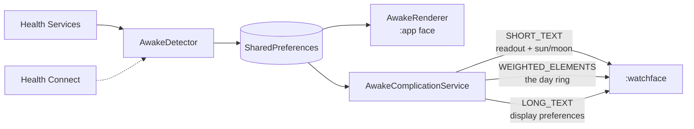

<div align="center">

# Vigil

**A Wear OS watch face that counts time awake, not clock time.**

[](https://kotlinlang.org)
[](https://wearos.google.com)
[](https://github.com/jagenaujagenau/vigil/stargazers)


*A real morning on a Pixel Watch 2: awake past midnight, asleep until just
before eight, three and a half hours since.*

</div>

## What is this?

A watch face that answers "how long have I been up?" instead of "what time is
it?". The big figure is the stretch you are in — time since you woke, or time
asleep once sleep is detected — and the band around the rim is today, showing
where the night and the day so far actually fell.

It detects sleep and waking on its own through Health Services. There is no way
to enter a wake time by hand: the times shown are observed, never typed.

## Quick Start

```bash
git clone https://github.com/jagenaujagenau/vigil.git
cd vigil
./gradlew :app:assembleRelease

adb install -r app/build/outputs/apk/release/app-release.apk
```

Then on the watch: long-press the current face → **Add new** → **Vigil**, and tap
it again to make it current. Grant the activity permission when asked.

Build **release**, not debug, even for sideloading: debug builds are unshrunk and
`debuggable`, which costs about 3 seconds of cold start. Both are signed with the
debug key, so both install directly.

<details>
<summary>Optional: the Watch Face Format build</summary>

```bash
./gradlew :watchface:assembleRelease
adb install -r watchface/build/outputs/apk/release/watchface-release.apk
```

This installs a *second* Vigil entry in the picker, one per package. On a watch
that runs the AndroidX face it is redundant — it exists for the day the platform
stops accepting AndroidX watch faces.

</details>

## How to read it

The band is **today**. Midnight at the top, the whole circle one calendar day,
coloured where you were awake and where you were asleep, left dim for the hours
still to come. Position on the band is a time of day, so a night sits where the
night was.

`00` at the top and `12` at the bottom give it a scale, with quarter ticks
between and a hairline for *now* that travels round as the day is lived. A sun or
a moon says which stretch is being counted.

## How it decides

Health Services reports sleep and waking; the face records the instant the state
changed rather than the instant the report arrived. On top of that:

- **Sleep is confirmed, not believed.** Reported sleep under 15 minutes is
  discarded — the signal flaps, and a misread would otherwise show a moon at
  someone who is up.
- **Naps do not end the day.** Sleep under 3 hours does not restart the awake
  count, and neither does a second wake-up within 3 hours of the recorded one. A
  nap still appears on the ring, because it happened.
- **A fresh install does not wait for morning.** Health Services stamps each
  report with when that state began, so the first report already carries the
  wake-up; Health Connect fills in the recorded night where it can; failing both,
  the count starts from now and is replaced by the first real observation.
- **No signal at all is survivable.** If Health Services stays silent for 36
  hours, a 3+ hour gap between two moments the screen was demonstrably being
  looked at is treated as a night.

Detection needs `ACTIVITY_RECOGNITION`, requested on first run. Denied, the face
still runs; it simply has nothing to count until it is granted.

## Settings

The pencil beside Vigil in the watch face picker opens them. They are only about
how it looks:

| Setting | Options |
| --- | --- |
| **Colours** | one of four schemes, each a pair (awake, asleep) |
| **Time** | on or off, and 12-hour or 24-hour |
| **Date** | on or off |

Asking for the activity permission is the only other thing the app does.

## Architecture

The face ships twice, and everything with logic in it lives in `:app`.

| Module | Format | Runs on |
| --- | --- | --- |
| `:app` | AndroidX watch face (`WatchFaceService`, custom `Canvas` renderer) | Wear OS 3–6 in practice |
| `:watchface` | Watch Face Format (declarative XML, no code) | Wear OS 4+, the format Google intends to require |

A Watch Face Format package may not contain executable code, so it cannot compute
"now minus when you woke up" by itself. Everything reaches it through
complications — one type per job, including the display preferences, since a
setting chosen in the system editor cannot reach back into this app.



The readout is published as a *dynamic* value — an expression the watch evaluates
on device — so it stays live between complication refreshes:

```kotlin
DynamicInstant.withSecondsPrecision(wokeUpAt)
    .durationUntil(DynamicInstant.platformTimeWithSecondsPrecision())
```

`SleepLog` keeps transitions, pruned to 48 hours, and `DayRing` turns them into
weighted segments across today. The `:app` face draws them as one stroked circle
— `RingGradient` for the colours, a dash effect for the ticks — while the Watch
Face Format side hands them to a `WeightedStroke`, which caps at seven elements,
so `DayRing.simplify` folds the briefest stretches away first.

## Project Structure

```
vigil/
├── app/                                  the face, and everything with logic
│   └── src/main/
│       ├── java/com/awakeface/watch/
│       │   ├── AwakeComplicationService.kt   publishes readout, ring, preferences
│       │   ├── AwakeDetector.kt              registration, confirmation, nap guards
│       │   ├── AwakeListenerService.kt       Health Services sleep/wake transitions
│       │   ├── AwakeRenderer.kt              dial, tick band, figure, footer
│       │   ├── AwakeWatchFaceService.kt      AndroidX face, editor declared in the manifest
│       │   ├── BootReceiver.kt               re-registers detection after a reboot
│       │   ├── DayRing.kt                    the log as today, in weighted segments
│       │   ├── Palette.kt                    the four colour schemes
│       │   ├── RingGradient.kt               the segments as sweep-gradient stops
│       │   ├── SettingsActivity.kt           Wear Compose settings, permission ask
│       │   ├── SleepHistory.kt               Health Connect, for a recorded night
│       │   ├── SleepLog.kt                   completed sleep/wake intervals
│       │   └── WakeStore.kt                  observed times, apart from preferences
│       ├── res/
│       └── AndroidManifest.xml
├── docs/
│   └── vigil.png
├── watchface/                            Watch Face Format package, no code
│   └── src/main/res/
│       ├── raw/watchface.xml             the face itself
│       ├── xml/watch_face_info.xml       required; points at the preview
│       └── drawable/preview.png          required; shown in the picker
├── build.gradle.kts
├── gradle.properties
└── settings.gradle.kts
```

Both faces read the same `SharedPreferences` file, so switching between them
keeps your history.

## Development notes

The build does not validate the Watch Face Format XML. Google's validator does:

```bash
curl -sL -o wff-validator.jar \
  https://github.com/google/watchface/releases/download/latest/wff-validator.jar
java -jar wff-validator.jar 2 watchface/src/main/res/raw/watchface.xml
```

Emulators are unreliable here: they refuse to list a sideloaded AndroidX watch
face, and the Wear OS 6 image surfaces no sideloaded face at all — including
Google's own samples. Use a Wear OS 5 image for the Watch Face Format build, and
real hardware for anything else.

To drive sleep detection on an emulator:

```bash
adb shell am broadcast -a "whs.USE_SYNTHETIC_PROVIDERS"        com.google.android.wearable.healthservices
adb shell am broadcast -a "whs.synthetic.user.START_SLEEPING"  com.google.android.wearable.healthservices
adb shell am broadcast -a "whs.synthetic.user.STOP_SLEEPING"   com.google.android.wearable.healthservices
```

A synthetic night lasts seconds, so it will be discarded as a blip. Backdate
`asleep_since` in the app's shared preferences to see the confirmed-sleep and
wake-up paths run.

## License

None yet. Without a licence file the default is all rights reserved, which means
nobody else may use, copy or modify this — worth adding one if that is not the
intent.
